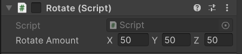

## Unity_Repositorio


<h1>Projeto desenvolvido em aula sobre Realidade Aumentada Unity</h1>

 >Processo intalação Vulforia

Unity e Vuforia fornecem uma solução poderosa para o desenvolvimento de aplicativos de AR, permitindo que os desenvolvedores criem experiências de AR incríveis para uma ampla gam7a de aplicações.

<p align="center">

</p>

[Baixar o Vuforia](https://developer.vuforia.com/user/login?url=/downloads/sdk%3F_%3D1678117884)
----------------------

É necessário criar uma conta e uma licença para registrar o seu Target (alvo). 
#### Ainda no Vulforia será necessário copiar a sua chave de licença para seu funcionamento.

Após isso faça o Download do seu banco de dados (target+features).  

<p align="center">

</p>

#### Primeiros Passos:


    ° Dentro do Unity faça a criação do AR camera e do imagem Target importando seu banco de dados

    ° Também faça a inclusão da sua chave copiada do vulforia

    ° Para realizar a rotação você pode incluir um cubo ou qualquer outro objeto 

    ° Para facilitar você pode inserir uma imagem ao seu objeto que será rotacionado


A imagem abaixo apresenta a ordem que os objetos devem ficar: 

1: ArCamera

2: ImageTarget

3: Cube (ou o objeto que você escolher)

<p align="center">

</p>

> ### Rotacionar o objeto
 
 Neste passo foi incluido uma rotação automatica do objeto. Então quando o QRCode for apresentado na tela, o objeto começará a girar.

#### O script para rotacionar o objeto:
```javascript
usando System.Collections;
usando System.Collections.Generic;
usando UnityEngine;

rotação de classe pública: MonoBehaviour
{
    public Vector3 rotateAmount;
    void Início()
    {
        
    }

    void Atualizar()
    {
        transform.Rotate(rotateAmount * Time.deltaTime);
    }
}
```
> Para adicionar o script basta clicar com o botão direito em seus Assets + Create + C# Script e depois mover o Script para dento do objeto criado.
. 

 Também é necessário incluir o eixo de rotação do seu objeto:

 <p align="center">

</p>

O resultado será o seu objeto rotacionado de forma automática. 

> ### Movimentar o objeto

No mesmo objeto criado, você pode agora adicionar movimento. Você poderá repassar as teclas para poder movimentar seu cubo no formato que desejar.

#### O script para movimentar o cubo:

```javascript
using System.Collections;
using System.Collections.Generic;
using UnityEngine;

public class movimento : MonoBehaviour
{
    // Start is called before the first frame update
    void Start()
    {
        
    }

    // Update is called once per frame
    void Update()
    {
        if (Input.GetKey(KeyCode.LeftArrow))
        {
            transform.Translate(0.01f, 0f, 0f);
        }
        if (Input.GetKey(KeyCode.RightArrow))
        {
            transform.Translate(-0.01f, 0f, 0f);
        }
        if (Input.GetKey(KeyCode.DownArrow))
        {
            transform.Translate(0f, 0f, 0.01f);
        }
        if (Input.GetKey(KeyCode.UpArrow))
        {
            transform.Translate(0f, 0f, -0.01f);
        }
    }
}
```

Após executar o Script, você poderá movimentar o seu objeto para os lados, para cima e para baixo utilizando as setas do seu teclado.


> ### Movimentar um segundo objeto

Neste processo será incluido um segundo objeto que também poderá ser movimentado. Então você irá precisar criar um novo objeto ou dublicar o objeto já existente.

```javascript
    using System.Collections;
using System.Collections.Generic;
using UnityEngine;

public class movi : MonoBehaviour
{
    // Start is called before the first frame update
    void Start()
    {
        
    }

    // Update is called once per frame
    void Update()
    {
        if (Input.GetKey(KeyCode.A))
        {
            transform.Translate(0.01f, 0f, 0f);
        }
        if (Input.GetKey(KeyCode.D))
        {
            transform.Translate(-0.01f, 0f, 0f);
        }
        if (Input.GetKey(KeyCode.S))
        {
            transform.Translate(0f, 0f, 0.01f);
        }
        if (Input.GetKey(KeyCode.W))
        {
            transform.Translate(0f, 0f, -0.01f);
        }
    }
}
```

 Após a execução do script o segundo objeto também poderá ser movimentado, agora utilizando as teclas "A, D, S, W". Neste momento então os dois objetos poderão ser movimentados de forma separada.

>Obrigada! &#128517;

